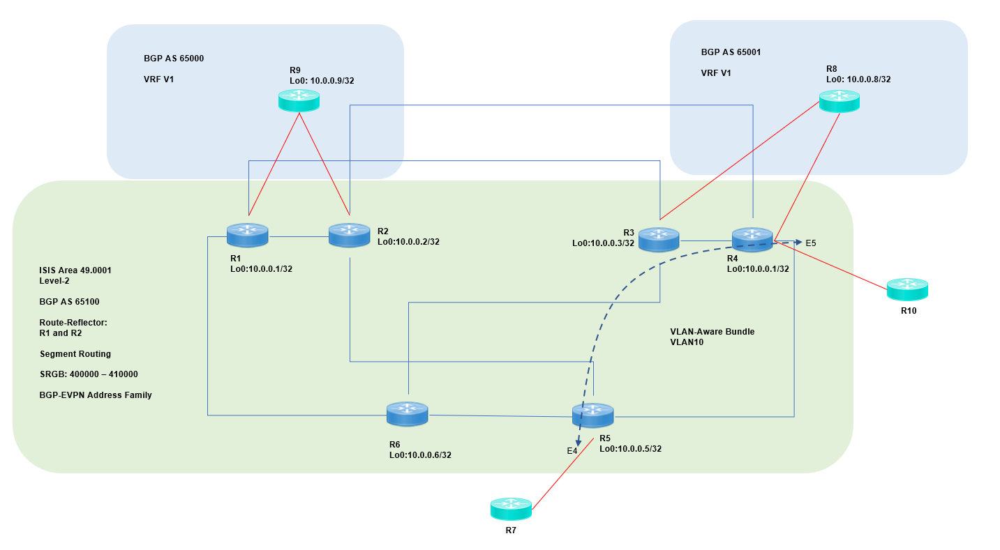

# ceos-sr-mpls — Arista cEOS SR-MPLS Containerlab Lab

Full-mesh SR-MPLS topology using **Arista cEOS 4.35.0F** with 10 routers and deterministic link design for IGP + Segment Routing + L2/L3VPN validation.

---

## Overview

This repository contains a fully reproducible **containerlab** project for experimenting with:

- Segment Routing (SR-MPLS)
- IS-IS 
- SR-TE (Adjacency SID & TI-LFA)
- MPLS L3VPN basic services
- Multi-node traffic engineering topologies

All routers run **Arista cEOS** using image `ceos:4.35.0F`, with startup configs, deterministic management IP addresses, and structured interface mapping for predictable behavior.

---

## Features

- 10× virtual Arista cEOS routers  
- Management VRF enabled (`CLAB_MGMT_VRF: mgmt`)  
- Consistent management subnet `172.100.100.0/24`  
- Startup configs in `configs/` directory  
- Quick launch — 2 commands to bring the whole topology up  

---

## Topology

### Devices

| Node| Mgmt IP        |
|-----|----------------|
| r1  | 172.100.100.11 |
| r2  | 172.100.100.12 |
| r3  | 172.100.100.13 |
| r4  | 172.100.100.14 |
| r5  | 172.100.100.15 |
| r6  | 172.100.100.16 |
| r7  | 172.100.100.17 |
| r8  | 172.100.100.18 |
| r9  | 172.100.100.19 |
| r10 | 172.100.100.20 |

### Link layout

Actual links are defined in the topology YAML.


### Topology Highlights

- Core underlay: IS-IS Level-2, Area 49.0001
- BGP AS 65100 (core), route-reflector = R1/R2
- SRGB 400000–410000, explicit paths enabled (Default to Arista cEOS)
- BGP EVPN + MPLS data-plane
- Two remote sites (R8/R9) in separate AS (65001 / 65000)
- VLAN-aware bundle for inter-site L2 (R7 to R10 via R4 and R5)

## Usage
### 1. Clone repository

```
git clone https://github.com/svenuscf/arista-ceos-sr-mpls.git

cd ceos-sr-mpls
```

### 2. Deploy topology

```
sudo containerlab deploy -t ceos-sr-mpls.yaml
```

### 3. Connect to a router

```
docker exec -it clab-ceos-sr-mpls-r1 Cli
```

(Replace r1 with any node r1–r10.)

or if you have configured routes to your internal network, you can SSH directly to the router management IP address.
For example:
```
ssh admin@172.100.100.11
```

### 4. Destroy topology

```
sudo containerlab destroy -t ceos-sr-mpls.yaml
```


## What you can test

- Prefix-SID allocation
- Adjacency SID
- TI-LFA fast reroute
- Explicit SR-TE tunnels
- MPLS L3VPN over SR
- Load-balancing and disjoint paths

This lab offers a clean SR-MPLS playground suitable for **DC backbone, SP core, or multi-site EVPN-migration architects**.

## Recommended Use Cases

- Lab validation ahead of production SR adoption
- Compare Cisco SR-MPLS vs Arista EOS implementation
- Demonstrate SR principles in interviews or blog posts
- Teach junior engineers SR fundamentals with real configs


## Author

**Gary Wong (Chun-Fung Wong)**
Principal Architect | CCIE x3 #8256 | CISSP
GitHub: https://github.com/svenuscf
